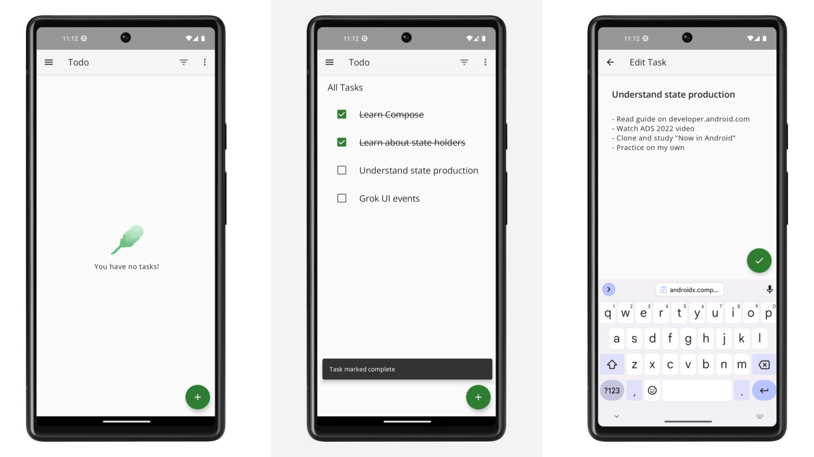

# howeverandroid-architecture-lab - Android 架构实践实验室 | Android Architecture Lab

[](https://github.com/however-yir/mobile-apps-lab/actions/workflows/android-ci.yml)
[](https://github.com/however-yir/mobile-apps-lab#readme)
[](./LICENSE)
[](https://github.com/however-yir/mobile-apps-lab)

🔥 基于 Android 架构样例的衍生工程，定位为“可学习、可二开、可演进”的任务管理应用实验平台。  
🚀 聚焦 Jetpack Compose、Hilt、Flow、Room、测试分层与工程规范。  
⭐ 适合用于 Android 架构学习、企业内训样板、以及业务项目冷启动骨架。

> Status: `showcase-ready`
>
> Upstream: `android/architecture-samples`
>
> 非官方声明（Non-Affiliation）:
> 本仓库为社区维护的衍生项目，与上游项目所属组织或其关联公司无隶属、无官方背书关系。
>
> 商标声明（Trademark Notice）:
> 上游项目名称、Logo 与相关商标归其各自权利人所有；本仓库仅用于兼容性与来源说明，不主张其商标权。
>
> Series: Part of [mobile-apps-lab](https://github.com/however-yir/mobile-apps-lab) (Android + iOS)

## 演示资产




## 目录

- [1. 项目概述](#1-项目概述)
- [2. 背景与目标](#2-背景与目标)
- [3. 架构与模块设计](#3-架构与模块设计)
- [4. 当前改造内容](#4-当前改造内容)
- [5. 功能清单](#5-功能清单)
- [6. 技术栈说明](#6-技术栈说明)
- [7. 仓库结构](#7-仓库结构)
- [8. 快速开始](#8-快速开始)
- [9. 配置说明](#9-配置说明)
- [10. 测试与质量保障](#10-测试与质量保障)
- [11. 二次开发建议](#11-二次开发建议)
- [12. 与上游差异](#12-与上游差异)
- [13. 贡献方式](#13-贡献方式)
- [14. License](#14-license)

## 1. 项目概述

`howeverandroid-architecture-lab` 基于 `android/architecture-samples` 进行衍生改造，目标不是替代上游，而是在保持上游架构教学价值的前提下，构建一套更贴近个人/团队实战改造的 Android 工程模板。

本项目关注三类价值：

- 学习价值：帮助理解分层架构、状态管理、依赖注入和测试策略。
- 工程价值：提供可演进的命名、配置、脚本、文档与协作规范。
- 业务价值：作为待办类业务、流程类业务、轻协同类业务的启动骨架。

## 2. 背景与目标

典型 Android 样例项目通常在“演示架构”上非常优秀，但在“直接接入业务”时还存在这些空白：

1. 命名空间与品牌标识无法直接用于团队仓库。
2. 配置分层、环境切换、敏感项管理不足。
3. 上游同步流程缺少脚本化约束。
4. 缺少衍生项目需要的文档与治理资产。

本仓库围绕以上问题完成首轮改造，并为后续扩展预留稳定接口。

## 3. 架构与模块设计

当前仍沿用上游“单 Activity + Compose + ViewModel + Repository + Local/Remote DataSource”的核心结构，并保持测试分层策略。

关键层次：

- UI 层：Compose Screen + ViewModel。
- Domain-ish 协作层：通过 UseCase 风格调用组织业务动作（逐步补齐）。
- Data 层：Repository 聚合 local/remote。
- DI 层：Hilt 管理依赖装配。
- Test 层：单元测试、集成测试、仪器测试。

## 4. 当前改造内容

首轮落地项：

1. 命名空间调整为 `com.howeveryir.android.archlab.todoapp`。
2. `applicationId` 调整为 `com.howeveryir.android.archlab.todoapp`。
3. 源码目录按新命名空间迁移。
4. App 名称改为 `However Task Lab`。
5. 新增配置模板 `config/local.sample.properties`。
6. 新增衍生协议说明 `LICENSE.HOWEVER`。
7. 新增上游同步脚本 `scripts/sync_upstream.sh`。
8. 新增改造说明与 50 点路线文档。

## 5. 功能清单

当前可用功能：

- 任务新增、编辑、删除。
- 任务完成状态切换。
- 任务筛选（全部/进行中/已完成）。
- 统计页（活跃占比、完成占比）。
- 本地持久化与状态恢复。
- 完整测试基线（含 UI 与单元测试）。

## 6. 技术栈说明

- Kotlin
- Jetpack Compose
- Hilt
- Room
- Kotlin Coroutines / Flow
- AndroidX Navigation Compose
- JUnit / Espresso / Compose UI Testing

## 7. 仓库结构

```text
.
├── app/
├── config/
│   └── local.sample.properties
├── docs/
│   ├── HOWEVER_DELTA.md
│   └── DERIVATIVE_50POINT_PLAN.zh-CN.md
├── scripts/
│   └── sync_upstream.sh
├── LICENSE
├── LICENSE.HOWEVER
└── README.md
```

## 8. 快速开始

1. 克隆项目：

```bash
git clone https://github.com/however-yir/mobile-apps-lab.git
cd howeverandroid-architecture-lab
```

2. 使用 Android Studio 打开根目录。  
3. 参考 `config/local.sample.properties` 注入本地参数。  
4. 运行 `app` 模块并执行测试。

可选命令：

```bash
./gradlew :app:assemble
./gradlew test
```

## 9. 配置说明

建议采用三层配置：

- `dev`：本地开发。
- `staging`：联调验证。
- `prod`：正式发布。

敏感信息（API Key、Token、账号等）不要写入源码，建议使用：

- 本地环境变量。
- CI Secret。
- 私有配置仓库或密钥管理系统。

## 10. 测试与质量保障

建议基线：

- PR 必须通过单元测试。
- 关键路径需具备 UI 自动化验证。
- 每次版本发布前执行一次全量回归。

建议补充：

- 静态扫描（detekt/ktlint）。
- 依赖漏洞扫描。
- 覆盖率门禁。

## 11. 二次开发建议

- 先保持核心链路稳定，再引入账号与远程同步。
- 将任务模型逐步扩展为“标签、优先级、截止时间、负责人”。
- 将 fake remote 迁移到真实 API 时，先补契约测试再替换实现。

## 12. 与上游差异

请查看：

- `docs/HOWEVER_DELTA.md`
- `docs/DERIVATIVE_50POINT_PLAN.zh-CN.md`

## 13. 贡献方式

欢迎通过 Issue / PR 参与改进。提交建议包含：

- 变更动机
- 关键实现
- 测试结果
- 兼容性影响

## 14. License

- 上游与核心代码遵循 Apache-2.0。
- 衍生层说明见 `LICENSE.HOWEVER`。